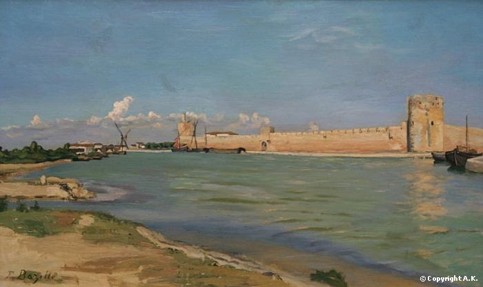

<!--  -->

Aujourd’hui on est le 8 avril, j’avais prévu une visite training en anglais de la Cité médiévale d’Aigües-Mortes avec pour auditoire des ami(e)s et collègues. Confinement oblige tout cela n’est que partie remise alors je vous emmène en balade « virtuelle » !

J’ai laissé mes yeux se promener sur une œuvre de Frédéric Bazille ce peintre montpelliérain qui passa sa courte vie (Né en 1841 et mort pendant la guerre de 1870) entre Paris et Montpelier et fut un proche de Claude Monet et contemporain de Renoir de Cézanne ou de Courbet, d’ailleurs il fit partie de ce mouvement ou cette école de l’Impressionnisme tout en étant souvent admis au Salon (académique) où Monet et bien d’autres étaient refusés et devaient se « contenter » d’exposer au Salon des refusés..

Alors je vous propose une petite visite guidée de la cité médiévale à travers 3 tableaux de ce peintre !

Voici l’histoire de ces 3 réalisations :

Au début de l'été 1866 (le peintre passait l’hiver à Paris et l’été à Montpellier ) , Bazille manifeste le désir de se rendre à Aigues-Mortes, cité médiévale d'où Saint Louis partit pour la croisade et haut lieu du souvenir protestant.  
Gaston Bazille met en garde son fils sur les fièvres et l'insalubrité des lieux durant la "grosse chaleur d'août" et ajoute : "Je n'ai jamais vu de peinture représentant Aigues-Mortes".

A la fin du mois de mai 1867, l'artiste s'y rend enfin : "Aujourd'hui il fait très beau temps et je vais partir tout à l'heure. J'ai commencé trois ou quatre paysages des environs d'Aigues-Mortes. Sur ma grande toile, je vais faire les murs de la ville se reflétant dans l'étang au coucher du soleil. Ce tableau sera fort simple et ne devrait pas être long à faire".

De cette campagne de peinture, Bazille ramène de nombreux croquis et trois tableaux. L'artiste a assimilé la leçon technique de Monet, et peint désormais avec assurance, en plein air, au milieu de la lagune camarguaise.  
L'austère majesté du site, la rigueur géométrique des remparts, l'atmosphère à la fois lumineuse et mélancolique trouvent un formidable écho chez Bazille. Seul, loin des sites déjà trop fréquentés d'Île-de-France ou de Normandie, c'est au coeur de son pays que Bazille trouve l'expression de son tempérament.

- Intitulé « les remparts d’Aiguës- Mortes » : ce premier tableau de petit format est exposé au [Musée Fabre](https://museefabre.montpellier3m.fr/)

Ici on peut apprécier la lumière crue du Midi languedocien qui baigne les paysages humides environnants la cité. Rappelons que la cité portuaire s’est développée sur des marais (« eaux mortes »et a bénéficié de l’exploitation des salins) .Le peintre a représenté une vue quelque peu idéalisée sur les célèbres remparts .

On devine au loin la petite Camargue et les maisons traditionnelles ..

Le second tableau qui nous rappelle le premier et porte le même titre mais offre quelques différences.

The Ramparts at Aigues-Mortes, 1867 (National Gallery , Washington)

- Et le troisième est un tableau représentant une des portes de la cité « la porte de la reine »

La Cité est enfermée dans un quadrilatère irrégulier d’1km640 entouré d’une enceinte achevée par les successeurs de Saint Louis entre 1272 et 1300 (son fils Philippe III dit « la hardi » et son petit fils Philippe IV dit « le Bel »)

Ce rempart est marqué par des ouvrages de défense et d’entrée qui portent des noms apposés à l’époque moderne.

Ici la « porte de la reine » rappelle la visite de la reine de France Anne d’Autriche et de Louis XIII en 1622 période trouble pour la région avec les guerres de religion et la persécution des protestants par les gardes royaux.

Frédéric Bazille nous propose une vision relativement sereine de la Cité et transmet le sentiment d’une certaine éternité, d’un temps retrouvé..

Porte de la reine à Aigües-Mortes, MET (metropolitan Museum of Art , New-York)

Cet artiste a contribué à la renommée d’Aigües -Mortes dans la seconde moitié du XIXème siècle avec ses fines œuvres à l’huile fine qui effacent les aspects plus réalistes (les conflits sociaux, la dureté des travaux de sauniers dans les salins …) et offrent une vision assez idyllique.

Le mot ou les mots de la fin…

Je ne peux que vous recommander de vous promener au cœur d’Aigües- Mortes par un matin de printemps ou d’été « à la fraîche » et de déguster en terrasse une fougasse sucrée , spécialité locale à la fleur d’oranger !

Et un autre jour allez flâner au musée Fabre dans l’Ecusson de Montpellier pour découvrir un peu plus cet artiste à travers une trentaine de ses réalisations (peintures, dessins, sculpture) ,des lettres qu’il écrivit, des objets lui ayant appartenu .Vous trouverez même un portrait de Bazille par Claude Monet !

Bien sûr si une visite guidée de la Cité de Saint Louis ou du musée Fabre vous fait envie…N’hésitez pas !mais en attendant….patience et restons confinés !
