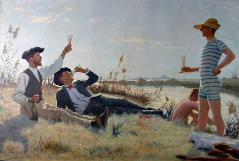

<!--  -->

_Aujourd’hui nouvelle "évasion"! Je vous emmène si vous le voulez bien en balade ..à ma façon et en respectant les mesures de confinement actuelles…Ce petit périple se fera entre le Gard et l’Hérault sur les traces d’un peintre montpelliérain méconnu (sauf dans la région peut-être) : Max Leenhardt_.

Ce peintre (1853-1941 à Montpellier) fut influencé par son cousin **Frédéric Bazille,** « l’impressionniste », de 12 ans son aîné mais aussi par **Alexandre Cabanel,** « l’académiste » qui fut son maître aux Beaux -Arts à Paris (où il étudia et passa une partie de sa vie).

Nous commencerons donc par ....**Aigues-Mortes** , cet ancien port et sa Cité dite de Saint Louis où nous avons passé un moment (premier article de mon blog le 8 avril ) puis nous irons respirer l’air de la campagne, de la garrigue et des vignes….enfin nous finirons à nouveau sur le littoral du côté de **Villeneuve-Les-Maguelone** ! Alors. ...Vous venez ? A chaque étape : un tableau de cet artiste et quelques précisions sur ce que vous pourriez (re)visiter dans quelques temps…

**Les prisonnières Huguenotes, 1893 œuvre exposée au Musée Fabre (Montpellier)**

La scène se déroule au sommet de la célèbre **tour de Constance**, sur la terrasse. Cette tour emblématique de la Cité mesurant 30 m de hauteur, a été achevée en 1248 et réalisée d’un seul tenant. A l’origine, ouvrage de défense pour un logis important et utilisé comme un lieu pour surveiller et contrôler l’accès au château qui aurait servi sous **Saint Louis** comme « oratoire » avant de partir en croisades.

Mais cette tour reste surtout célèbre , car à partir de 1686, suite à la révocation de **l’Edit de Nantes** par Louis XIV, elle fut affectée comme prison pour les huguenots c’est-à-dire les protestants :ce fut la pire des geôles !Et à partir de 1715 , seules des femmes y furent emprisonnées , suite à l’évasion spectaculaire d’une quinzaine de chefs **camisards**! Elles vécurent jusqu'à 38 femmes à l'intérieur et leurs conditions de détention furent terribles : humidité, froid, obscurité...Certaines huguenotes y moururent , des enfants naquirent, plusieurs abjurèrent ..

La plus célèbre de toutes, véritable héroïne populaire, est sans aucun doute **Marie Durand** , ardéchoise, arrêtée en 1730 qui résista pendant ses 36 années de détention !Elle fit preuve d’une foi inébranlable et d’une énergie hors normes. On lui attribue l’inscription « _register_ » (résister) dans la salle haute de la tour…

Ces femmes n’avaient que de rares occasions de sortir sur la terrasse comme le peintre les a représentées… je suis certaine que vous avez identifié Marie Durand et que ce tableau éveille en vous beaucoup d’émotions, non ?
Cette oeuvre plutôt "académique" date de sa meilleure période, la plus féconde, originale et libre.

_La visite de la Cité d’Aigues-Mortes et en particulier de la tour de Constance et des remparts vous réservera bien des surprises !_

**Entre les vignes/Les vendanges en Languedoc** (1898 -1901) : à Clapiers sur les coteaux du mas de Paul, propriété de la famille Leenhardt. Don à la Société d'Agriculture.

Le peintre qui avait eu un destin plutôt facile (famille très aisée, nombreux voyages ) perdit a 40 ans son grand amour, sa femme Marie Castan alors qu'elle mettait au monde leur deuxième fils.
L'artiste effondré par cette tragédie décida de quitter Paris et de rentrer "dans le midi" avec ses 2 enfants et se rapprocher de sa famille. Dès lors, sa peinture va la plupart du temps subir son mal-être (trait plus lourd, moins de lumière, mélancolie..)mais ce ne sera pas le cas dans cette toile bucolique de grande envergure.En effet,ce retour dans son atelier entre vignes et champs réveille chez lui le désir de peindre. Il trouve en la garrigue de Clapiers, Jacou, Castelnau , une sorte de "terre sainte " (c'est aussi le retour à la foi protestante) .Ici il représente parfaitement l'ambiance des vendanges dans le Midi:le travail, la force, effort. C’est la vie exubérante, la joie de vivre, le bon vin mais aussi une référence à l'actualité viticole de l'époque et un certain contexte familial (vaste famille de cultivateurs et de négociants en vins, d’hommes d’affaires et de notables).
Tout en respectant une composition académique on note diverses influences dans la façon de peindre la nature, celle des **naturalistes** et dans le traitement de la lumière..celle d'un certain **Claude Monet**!
Cette toile me séduit énormément: et vous?

Je n'ai pas les clés du mas de la famille Leenhardt mais...je vous propose de découvrir un magnifique domaine viticole avec balade dans les vignes et une visite commentées du domaine familial situé à **Saint Christol**, (entre deux vignes), célèbre terroir. Ce domaine c'est celui de la famille **Guinand** qui travaille la vigne avec respect et en accord avec les principes **"Terra Vitis**": tradition et modernité voilà en deux mots! Bien entendu nous vous proposerons avec Sophie et Fabien une dégustation de leurs jus : des blancs, rosés, rouges dont certains vieillis en fûts de chêne. Alors : vous me suivez?Dès que cela sera possible! en attendant n'hésitez pas à visiter leur site internet vous verrez

[Le site du Domaine de Guinand](https://domaineguinand.com/le-domaine-guinand/)

**Les étudiants à Maguelonne**
Retrouvée dans un cagibi de l'Université de Montpellier, cette oeuvre fut longtemps accrochée dans le hall de la faculté de Médecine. On y découvre des étudiants au bord du Lez et près de **Maguelone**. A priori le peintre a représenté ces jeunes parisiens venus à Montpellier pour les cérémonies organisées pour le centenaire de l'Université . Certains connaisseurs évoquent la rencontre- sur la plage à Palavas- entre **Paul Valéry** (Sétois) , alors étudiant en droit à Montpellier, et Pierre Louÿs, venu représenter les étudiants parisiens pour les cérémonies du centenaire.
Que pensez-vous des tenues de l'époque? L'ambiance semblait être conviviale , n'est-ce-pas?

_Que visiter à Maguelone ? la cathédrale des sables: isolée entre lagune et mer, sur une presqu'île qui se trouve aujourd'hui encore bien éloignée de Montpellier. Pendant environ un millénaire, ce fut le siège de l'évêché , du VIème au XVIème siècle, lorsqu'en 1536 on décide son transfert à Montpellier..Ainsi, Maguelone est progressivement délaissée du fait de son isolement, insécurité, insalubrité ..(donc Maguelone perdit l'évêché à la faveur de Montpellier..et bien plus tard dans les années 80 récupéra la maison d'arrêt..)_

_Aujourd'hui c'est dans un écrin exceptionnel et très protégé (accessible à pied ou en petit train) que l'on peut visiter cet héritage du Moyen-Age. Depuis 1969 le CAT "les compagnons de Maguelone" devenu ESAT en 2005 est installé sur l'île et gère l'accueil du public sur tout le site (boutique et restaurant) et s'occupe aussi de l'exploitation du domaine (viticulture, pêche, ostréiculture)_..Alors on y va?

Avant de vous quitter..quelques précisions sur Max Leenhardt:

Une place de Montpellier porte son nom, ainsi qu'un escalier au **Musée Fabre** qui compte 17 oeuvres de Max Leenhardt.

A Paris à la Gare de Lyon, il a décoré le restaurant [Le Train bleu](<https://fr.wikipedia.org/wiki/Le_Train_bleu_(restaurant)> "Le Train bleu (restaurant)"),en particulier la salle dorée : [_La Meije_](https://fr.wikipedia.org/wiki/La_Meije "La Meije"), 1900.

Il est inhumé au cimetière protestant de Montpellier.

Et un blog qui est susceptible de vous intéresser notamment pour son oeuvre "les vendanges".

_A très bientôt ! Merci pour votre fidélité et je reste attentive à vos remarques, questions, attentes ! Prenez soin de vous !_
