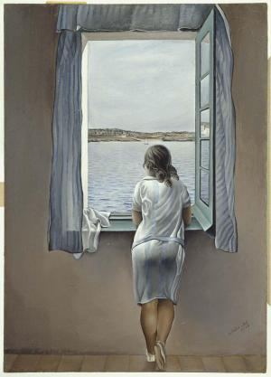

**Les modèles de Toulouse-Lautrec, Morisot, Bazille et Dali.**

Pourquoi ce sujet ? Du fait d'un souvenir du premier tableau que j'ai "étudié" (un bien grand mot à 16 ans), en classe de seconde et en cours d'espagnol LV3 ! J'étais loin de prendre conscience de l'impact qu'aurait cette oeuvre qui finalement ne m'a jamais quittée et qui, peut-être, aujourd'hui, lorsque j'y repense fait une sorte d'écho à mon "moi professionnel" (Guide et professeur d'espagnol)... Allez je vous le dévoile : il s'agit d'un portrait représentant la soeur de Salvador Dali, Ana Maria **"jeune fille à la fenêtre".**

Pour quelles raisons ce portrait m'a t'il marquée ? Avec le recul, je pense qu'inconsciemment je devais m'y identifier...Une jeune fille, dans sa chambre, regardant un paysage méditerranéen...Je rêvais depuis ma chambre picarde de partir vivre en Espagne ! J 'avais une reproduction accrochée dans ma chambre pendant longtemps. Depuis, j'ai eu la chance de le voir "en vrai" à plusieurs reprises d'ailleurs mais la première fois ce fut une véritable émotion ! C'est ce que je recherche dans la peinture...et c'est aussi ce que j'espère vous transmettre...Alors, vous me suivez ?

Je reviendrai sur cette oeuvre un peu plus tard (je sais que nombreux d'entre vous l'aimez beaucoup) mais en attendant, posons-nous la question : quand et pourquoi les peintres ont-ils représenté des femmes de dos (ou trois-quart ) ? Je veux parler de portraits, car bien avant, dans des scènes d’Histoire (souvent mythologiques) des femmes étaient représentées de dos pour les besoins de l’histoire, du mythe. Ce que je vous propose ce sont donc quelques œuvres choisies, qui me plaisent , d'artistes célèbres des 19ème et 20ème siècles avec une évolution de la position des sujets féminins pour finir avec des modèles complètement de dos !

Pas de **Picasso** grand croqueur de femmes mais presque jamais de dos ! Pas de **Frida Kahlo** dont plus de la moitié de l’œuvre est constituée de ses autoportraits … c’est vrai qu’il doit être impossible de se représenter soi- même de dos ou bien à partir d’une photo…

Rappelons que le portrait était un genre très prisé dans le passé, notamment avant l'apparition de la photographie. Les portraits d'apparat, de femmes de la famille royale ou impériale, de la noblesse ….

Je suis sûre que vous en avez en tête ! La plupart du temps selon les règles de l'Académie et le goût de l'époque ces modèles féminins posaient en regardant le maître et donc le spectateur. Elles pouvaient porter une fleur, un livre, un symbole de leur condition. Par exemple, prenons le portrait, tableau le plus célèbre du monde, **La Joconde** de Léonard de Vinci (1503-1506), qui représente bien l'idée du portrait. Néanmoins, la position de la jeune femme, les mystères autour de son identité, le célèbre sfumato et le paysage en arrière-plan ont contribué à sa renommée et en font une oeuvre très "moderne" pour la Renaissance.

Ce qui est donc intéressant, et ce qui m'a interpellée c'est de constater que peu à peu les femmes dans les portraits vont devenir des femmes de différentes origines sociales et qu'à partir du XIXème siècle-et des distances que les artistes (les Impressionnistes comme chefs de file) prendront avec les règles de l'Académie- les femmes seront représentées parfois de face, mais aussi de trois -quart ne regardant plus l'artiste (et le spectateur), et même de dos ! Ce dernier point était sûrement inconcevable autrefois. Bref, elles vont nous tourner le dos!mais pourquoi?

 **Au salon de la rue des moulins**

En parcourant la vie et l'oeuvre prolifique du peintre et graphiste Henri **Toulouse Lautrec** (1864-1901) on y découvre rapidement la place qu'il a donnée aux femmes dans ses affiches, gravures, peintures ou dessins. Ce qui interpelle c'est ce regard toujours tendre qu'il porte sur elles quelques soient leurs conditions et modes de vie. Pas de jugement, contrairement à un Degas par exemple . Cela, peut-être parce que cet artiste a souffert toute sa vie de la difformité de son corps. Il quitta sa région natale (**Albi , le Tarn** ) pour les nuits brumeuses de la Butte parisienne et l’univers interlope de ses filles, dites de joie, dont il côtoya et partagea les détresses.

Le tableau que j'ai choisi « au salon de la rue des moulins » fut réalisé en 1894 quand le peintre avait 30 ans. Ce n'est pas réellement un portrait, c’est davantage une scène traitée comme "une scène d'histoire", de taille imposante (111,5 x 132,5 cm) mais dont le thème évoqué est le quotidien des prostituées qui attendent le client dans des sofas recouverts de velours rouge. Il s'agit d'un des tableaux les plus aboutis de sa production. Il résulte d’une multitude de croquis et d’études préparatoires, dont une esquisse au pastel. Toulouse- Lautrec a réalisé plus d’une cinquantaine d’œuvres, peintures, dessins et lithographies, sur le thème des maisons closes, qu’il fréquenta assidûment jusque vers 1895. Au premier plan, cette jeune femme de trois-quart, une prostituée dénommée Mireille ; elle est tournée vers la tenancière de la maison, figure hiératique, vêtue d’une longue robe fermée jusqu’au col, qui semble elle aussi perdue dans ses pensées. Toulouse-Lautrec a dépeint la solitude ou plutôt les solitudes de ces femmes. Les personnages ne se parlent pas, ne se regardent pas. Ce tableau, et en particulier son personnage principal, auraient inspiré à Julio Cortazar, grand écrivain argentin, l'idée que la Mireille de Lautrec était la blonde Mireya, grande figure de la vie nocturne de Buenos Aires au début du XXème siècle ! Ici , donc le modèle ne semble pas poser pour le peintre qui saisit un moment de la vie de ces femmes , comme un "instantané" mais réalisé avec beaucoup de soin.

Je ne saurais vous recommander la visite de l' incontournable Musée Toulouse-Lautrec, situé dans le Palais de la Berbie à Albi. Ce musée abrite la plus grande collection publique de l’artiste et a pour écrin les jardins de l’exceptionnelle Cité épiscopale de la cathédrale Sainte Cécile d’Albi (la plus grande cathédrale de briques au monde et ses 18500m2 de fresques et de décors peints !)

Berthe Morisot, **Femme à sa Toilette**, 1875-1880, (60,3 x 80,4 )cm, Chicago, Art Institute of Chicago Art Institute of Chicago.

**Impressionniste** de la première heure, Berthe MORISOT Berthe ( Bourges, 1841 - Paris, 1895 ) s'attacha à une représentation attentive de la figure humaine ; elle explora mieux qu'aucun autre artiste de sa génération l'inachèvement de la peinture. Oui, ici je vous propose un tableau un portrait de dos qui fut rejeté par certains critiques notamment : savez-vous pour quelles raisons?

Sylvie Patry, conservatrice au **musée d'Orsay** nous dit: *"Elle a sans doute été longtemps moins prise au sérieux que ses confrères masculins parce que c'était une femme, parce que ses sujets représentaient des sujets féminins, ce qui est évidemment assez réducteur..."mais aussi "À travers sa peinture, elle montre que, contrairement à ce que l'on pensait à l'époque, le mariage et la maternité ne sont pas les seules voies d'accomplissement pour une femme"*

On comprend bien qu'une femme peignant avec audace un modèle féminin devant son miroir, dans un moment d'intimité presque érotique pour certains, cela n'a pas été jugé convenable par la critique !Que voit on sur ce délicieux portrait? Beaucoup de spontanéité, de charme, grâce, délicatesse, fraîcheur, subtilité, raffinement, sensation, émotion : une sorte de symphonie en blanc et gris d’une femme réalisant sa toilette. Ce portrait a été perçu comme l’expression même d’un art « féminin » qui semble s’affirmer ici autant dans sa manière que dans son sujet.
Malgré tout, Berthe Morisot parvint à s’affirmer en peintre et en peintre qui vendait ses œuvres.Elle sut développer une stratégie capable de transcender les a priori de l'époque.
Elle réalisa de nombreuses figures et des portraits tout au long de sa carrière, soit environ 70% de sa production. Elle représentait des fillettes, des jeunes filles et des femmes, souvent celles de sa famille, dans l’intimité de la vie bourgeoise ou dans des jardins.Regrettons qu'un grand nombre ne nous soit pas parvenu, car elle détruisit ses oeuvres de jeunesse ! Elle était dans le groupe impressionniste dont elle fut membre fondateur et doyenne, respectée par ses camarades et admirée notamment par son beau-frère **Édouard Manet**, mais aussi **Degas, Renoir, Monet.**

Les tableaux de Berthe Morisot se trouvent pour beaucoup dans des collections particulières. Toutefois, nous avons l'immense chance de pouvoir contempler au **Musée Fabre de Montpellier** *Jeune femme assise devant la fenêtre, dit l'Eté* (1879). J'en profite pour évoquer la présence d'oeuvres impressionnistes dans ce musée ; en effet, vous y trouverez un tableau ou plus de ces grandes figures de ce mouvement/courant des artistes suivants : Sisley, Degas, Renoir, Manet, Monet ! Et bien sûr je ne résiste pas à vous proposer un portrait réalisé par Frédéric Bazille, oeuvre qui est exposée au Musée d'Orsay mais qui fut prêtée au Musée Fabre lors de la grande exposition qui fut consacrée à l'artiste montpelliérain en 2016.

Comme la plupart des artistes du courant avant-gardiste de l'époque, Bazille a peint directement en plein air, sur le motif : il chercha particulièrement à représenter des paysages ou des figures en lumière naturelle. Ce tableau, exécuté pendant l'été 1864, alors qu'il n'avait que 23 ans, en est un bel exemple .

**_La robe rose**_ (1864 ) Huile sur toile, (147 x 110 cm )

Le modèle est Thérèse des Hours, une cousine de Bazille. En effet les 2 familles Bazille et des Hours passaient leur été dans la magnifique propriété familiale de Méric, à Castelnau-le-Lez, village des environs de Montpellier. On peut observer que la maison et son parc se trouvent légèrement en hauteur, et dominent le village. Aujourd'hui il est très difficile de retrouver ce point de vue tant la ville a changé.. Ce jour-là , donc, Frédéric Bazille fit poser Thérèse sur la terrasse, à l'extrémité du jardin on y voit les résineux
Elle portait une robe simple, un peu "bouffante"au niveau des épaules. C'est cette robe à rayures verticales roses et gris argenté qui a donné le titre au tableau.La jeune fille porte aussi un tablier noir, nous donnant l'impression de grande simplicité; on peut penser qu'elle était en train de réaliser des tâches domestiques. Elle tourne le dos au spectateur et dirige son regard vers le villages et ses maisons dont les toits couverts de tuiles orangées sont caractéristiques du Midi et vers l'église. Pourtant, dans un dessin préparatoire, Thérèse était tournée vers le spectateur, dans une position typique du portrait traditionnel. Il est intéressant de constater que le peintre a finalement choisi de montrer le dos de son modèle, plongeant ainsi sa toile dans une atmosphère de calme, de plénitude et d'empathie..et provocant chez nous une certaine émotion, un sentiment de tendresse peut-être,non?

Ce sont ces mêmes sentiments parfois troublants que l'on retrouve face à l'oeuvre de **Salvador Dali** (1904-1989) "muchacha en la ventana/asomada a la ventana" soit "jeune fille à la fenêtre", ce tableau qui m'a menée à écrire cet article. Le modèle, qui à maintes reprises posa pour l'extravagant artiste, est Ana Maria, sa soeur. Elle posa pour lui de face, de profil, de trois-quart, de dos.Elle lui permis de travailler le portrait féminin avant qu'il ne rencontre Gala qui deviendra son épouse,sa muse, sa Galatea!
La scène se déroule à **Cadaqués**, dans ce village du Cap de Creus, où les Dalí entament à partir de 1910 une longue séquence de séjours estivaux. L'environnement représenté sur cette toile est probablement la vue depuis l'une des fenêtres de la maison que possède la famille sur la plage d'Es Llaner : au premier plan la mer et, à l'horizon, et la rive. C'est un paysage que Dalí représenta à diverses reprises. On y reconnait ces maisons qui se reflètent dans la vitre de la fenêtre, les mêmes maisons blanches qui personnifient encore aujourd'hui le paysage des lieux. C'est sans aucun doute l'environnement que Dalí peindra avec le plus insistance durant ses années de formation, dans les années 10 et 20, où il épuisa la thématique paysagère. Au début des années 1920, le jeune Dali s'essaya dans différents styles du moment : cubisme et réalisme. Cela avant 1927, où il entama son étape surréaliste. C'est de cette époque que date la série de 17 portraits de ses proches dont 6 consacrés à sa soeur qu'il dévoila dans sa première exposition individuelle à Barcelone (Galeries Dalmau) en 1925.
Ici, ce qui nous captive c'est à la fois ce camaïeu de tons gris et bleutés que l'artiste a décliné pour les vêtements d'Ana Maria mais également les rideaux, la mer, le ciel. C'est aussi, la lumière qui fait ressortir la silhouette féminine marquée par un jeu d'ondulations qui trouve écho dans les plis de la robe, ceux du foulard, des voilages mais aussi dans les flots de la mer et les nuages discrets de ce ciel méditerranéen.
Il émane de ce portrait beaucoup fraîcheur, de tendresse des couleurs et de luminosité. On ressent à le contempler une sensation de paix, de plénitude et de bien-être. C'est comme si Dali parvenait à nous faire passer sa propre émotion de peintre ...

Ana Maria Dali, des années plus tard en 1949, se remémorait les longues séances où elle avait servi de modèle à son frère : *«Los retratos míos que mi hermano pintó en esta época son incontables. Muchos de ellos eran meros estudios de los bucles y de un hombro siempre descubierto. Pintaba paciente e infatigablemente, y a mí no me cansaba posar para él, pues nunca me ha aburrido el permanecer quieta y silenciosa. \[…] Durante las horas en las que le servía de modelo, yo no me cansaba de observar aquel paisaje que ya, para siempre, ha formado parte de mí misma. Pues siempre me pintaba cerca de alguna ventana. Y mis ojos tenían tiempo de entretenerse en los detalles más pequeños»*. **Besoin d'une traduction?**

*"Les portraits que mon frère a faits de moi à cette époque sont innombrables. La plupart étaient de simples études de mes boucles et d'une épaule découverte/dénudée. Il peignait patiemment et inlassablement, et moi je ne me lassais pas de poser pour lui, car cela ne m'a jamais ennuyée de rester sans bouger et silencieuse (...) Pendant ces heures où je servais de modèle, je ne me lassais pas d'observer ce paysage qui, de tout temps, a fait partie de moi. En effet, il me peignait toujours près d'une fenêtre. Et mes yeux avaient le temps de s'attarder sur les détails les plus infimes"* Preuve en est ce portrait dont le titre est simplement **"retrato"** réalisé la même année et conservé lui aussi au Musée Reina Sofia de Madrid

C'est donc dans ce musée madrilène que l'on trouve conservés de nombreux tableaux et dessins de Dali mais le lieu incontournable pour mieux appréhender l'artiste loufoque, le génie, l'homme, rien de tel que de se rendre dans son théâtre musée qui fait partie de sa fondation "**Fundació Gala-Salvador Dalí, Figueres"**. Je ne vous ferai pas la visite des lieux sur cet article mais je tâche de vous en mettre une photo car c'est un lieu incroyable! A l'intérieur vous y retrouverez Ana Maria dans "*La noia dels rulls (La jeune fille aux boucles/jeune fille de l'Ampurdan)*", huile sur bois réalisée en 1926. Ce dos, ainsi que ce fessier, lui auraient appartenu et préfigurent les dos et les fesses dont rêve Dali, et dont il tombera amoureux: ceux de Gala qu'il n'a pas encore rencontrée.

C'est au printemps 1929, à Paris que Dali rencontra Gala alors qu'il venait de réaliser le film "un chien andalou" avec **Luis Bunuel** ; c'est à cette époque qu'il fit la connaissance de **Paul Eluard** et des surréalistes .

J'achève donc ce long article avec cette huile sur toile parfaitement carrée ( 60,5 x 60,5 cm) et presque "high tech" ! Je vous en donne d'abord le titre complet "**Dali de dos peignant Gala de dos éternisée par six cornes virtuelles provisoirement réfléchies par six vrais miroirs**"!! Il la réalisa vers 1972-1973 et elle est aujourd'hui visible dans son musée ! C'est une oeuvre stéréoscopique, c'est-à-dire en utilisant le système Fresnel à réseaux, le même qui est appliqué aux cartes postales à relief (vous connaissez je suis sûre!). Cette toile est une des multiples expériences menées à bien par Dalí dans les années soixante-dix. À travers la stéréoscopie, l’artiste voulait atteindre la troisième dimension et obtenir un effet de profondeur. Comme dans Las **Meninas de Diego Velasquez**, le peintre, ici aussi, apparaît en train de créer....

C'est ainsi que s'achève cette évasion dans différents univers, lieux et époques. J'espère que vous n'en avez pas "plein le dos" et ne pas vous avoir ennuyés... Ai-je réussi à vous transmettre un peu de ma passion, du fruit de mes recherches et de mon travail ! Je suis toute attentive à vos remarques, questions, corrections, impressions sur ce blog ou par sms, mail, fb, insta... Je tiens à votre disposition mes sources bibliographiques etc... Bref we keep'n touch!
Merci à tous!